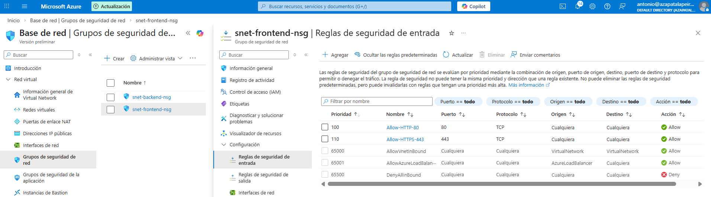
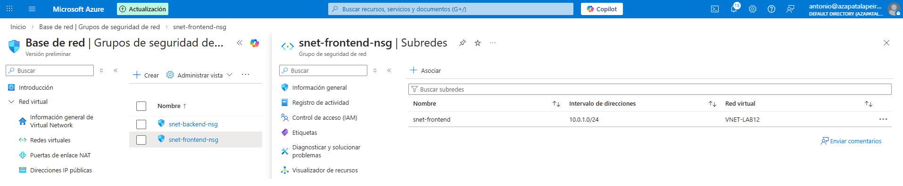
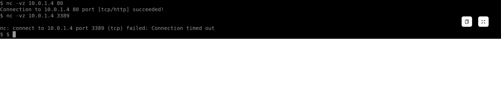

# Lab 13 - Filtrado de tráfico con NSG (Web en FrontEnd)

## Objetivo
Aplicar un control básico de red (tipo “firewall” a nivel L3/L4) usando un Network Security Group, para que la subred FrontEnd solo permita el tráfico web necesario (HTTP/HTTPS). La idea es dejar la subred preparada para servicios públicos sin abrir puertos de más.

## Qué he hecho en este laboratorio
1. He creado un NSG llamado `snet-frontend-nsg`.
2. He añadido reglas de entrada para permitir únicamente:
   - TCP/80 (HTTP)
   - TCP/443 (HTTPS)
3. He asociado el NSG a la subred `FrontEnd` para que cualquier VM nueva en esa subred herede estas reglas automáticamente.
4. He validado la conectividad con una prueba desde otra máquina (Test-NetConnection).

## Configuración utilizada
- NSG: `snet-frontend-nsg`
- Reglas inbound:
  - Allow-HTTP-80 (priority 100)
  - Allow-HTTPS-443 (priority 110)
- Asociación:
  - Subnet: `FrontEnd` (dentro de `VNET-LAB12`)

## Evidencias

### 01 - Reglas inbound 80/443

### 02 - NSG asociado a la subred FrontEnd

### 03 - Prueba de conectividad (Test-NetConnection)

## Checklist de verificación
- [x] Solo puertos 80/443 permitidos en la subred FrontEnd
- [x] NSG aplicado a nivel de subred (no solo a una VM)
- [x] Conectividad validada desde otra máquina/subred

## Qué le diría a un cliente / en entrevista
“Aplico el NSG a nivel de subred para que las reglas se hereden por defecto. Así evito que la seguridad dependa de cómo cree cada VM el usuario y mantengo el FrontEnd abierto solo a lo necesario (web), dejando el resto cerrado.”
